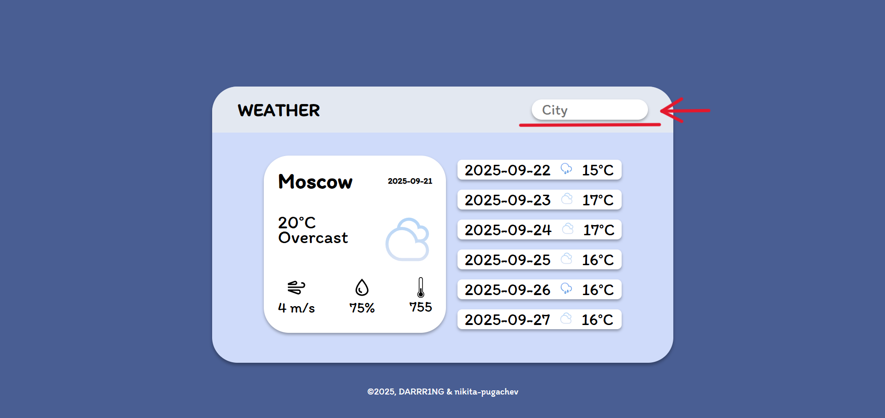
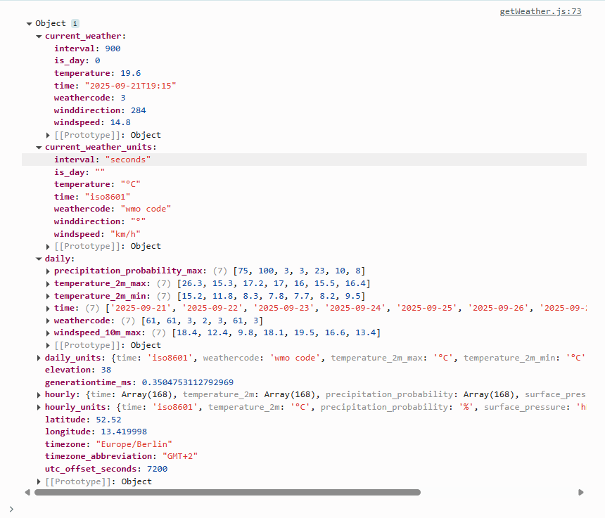

# WEATHER
[Проект на GitHub](https://github.com/nikita-pugachev/weather.git)

[Проект на GitHub Pages](https://nikita-pugachev.github.io/weather/)

## Ссылка на макет
[Макет проекта в Figma](https://www.figma.com/design/2Np86yN60iuCjdAAFQu3jA/%D0%A1%D0%B0%D0%B9%D1%82-%D0%BF%D0%BE%D0%B3%D0%BE%D0%B4%D1%8B?node-id=0-1&t=xdnlI7clFslejW3i-1)

## О проекте
Проект представляет собой сайт для просмотра прогноза погоды. В настоящий момент проект находится на стадии разработки

## Документация к проекту
Данная работа представляет собой pet-проект. Здесь реализован сайт для просмотра прогноза погоды.

### Проект имеет следующую структуру:
* ```index.html```
* ```styles```
* ```fonts```
* ```svg```
* ```script```, состоящий из файлов ```getWeather.js``` и ```main.js```

### Используемые технологии
* 
* 
* 

### Логика программы
Для того, чтобы реализовать полноценно функционирующий сайт для просмотра прогноза погоды, необходимо задействовать API, с которого мы получим необходимые данные. Для нашего сайта использовались следующие API:

* ```https://geocoding-api.open-meteo.com/v1/search?name=${encodeURIComponent(city)}&count=1&language=en&format=json```. Данный API принимает в значение фильтра город и возвращает его географическую ширину и долготу. В проекте в значение фильтра передается переменная, отвечающая за ввод пользователя в форму.

<div align="center">
    
</div>
Больше о данном API можно узнать по ссылке:

[Geocoding API](https://open-meteo.com/en/docs/geocoding-api)

* ```https://api.open-meteo.com/v1/forecast?latitude=${latitude}&longitude=${longitude}&current_weather=true&hourly=temperature_2m,precipitation_probability,surface_pressure,windspeed_10m&daily=weathercode,temperature_2m_max,temperature_2m_min,precipitation_probability_max,windspeed_10m_max&timezone=auto```. Данный API необходим для того, чтобы запрашивать данные о погоде. В проекте в значение передается географическая долгода и широта, полученная из ```Geocoding API Open-Meteo```. Этот API возвращает данные в формате json, который легко спользовать в JavaScript для отображения статистики о погоде.

<div align="center">
    
</div>


## Связь с разработчиками
[](https://t.me/RUSSS1NG)
[](https://t.me/DashaPeachas)